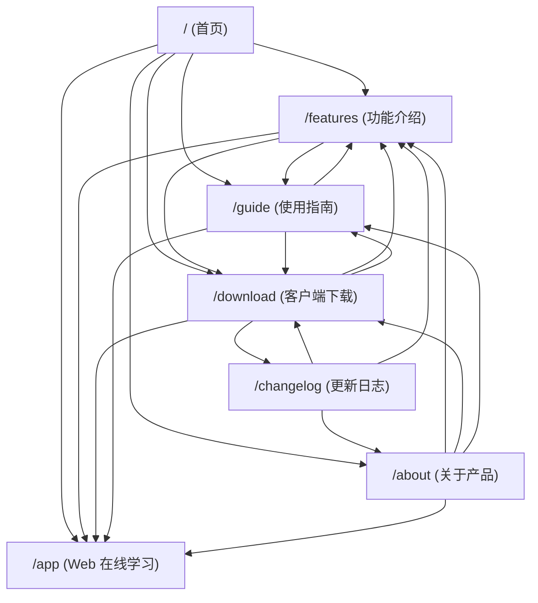

# Kotobud 官网第二阶段品牌 SEO 优化与实体认知增强交付报告

> **项目域名**：`https://kotobud.com/`  
> **优化周期**：第二阶段（品牌实体认知、语义关联与全站信息架构深化）  
> **状态**：已构建、已测试、已全量部署至 Cloudflare 生产环境，实测验证全部通过。

---

## 1. 优化前主要问题（品牌 SEO 现状审计）

在第一阶段完成基础可抓取性（SSG 预渲染、软 404 修复、IndexNow 协议）后，对生产环境进行深度品牌实体审计，发现以下阻碍“Kotobud = 日语背词软件”这一认知建立的问题：

1. **首页缺乏明确的主谓宾“实体定义式语句”**：
   - 原首屏偏向抒情与感性表达（如“每天，认识一点日语”、“一词一句，慢慢积累”），但搜索引擎在提取主体摘要时，缺乏清晰的实体定义句（“Kotobud 是什么、面向谁、解决什么痛点”）。
2. **JSON-LD 结构化数据深度不足**：
   - 首页原有的 `WebSite` Schema 缺少 `alternateName`（别名体系）、`inLanguage` 和详细描述；
   - `SoftwareApplication` 缺少详细的 `featureList`（特性明细）与 `applicationSubCategory`（语言学习细分类别）；
   - 二级页面（`/features`, `/download`, `/about`, `/guide`, `/changelog`）缺少 `BreadcrumbList`（面包屑）Schema，使得 Google 搜索结果中无法展现优雅的层级路径。
3. **6 个核心页面的 Title 意图模糊与格式不统一**：
   - 原部分页面使用 `功能特性 - Kotobud...` 或 `... - Kotobud`，格式不统一且缺乏明确长尾意图修饰（例如未体现“FSRS 科学复习”、“安装版与便携版”等具体检索意图）。
4. **内部链接结构与锚文本偏弱**：
   - 多数页面之间链接偏单向，且底部或正文链接大量使用“立即体验”、“查看指南”等泛指词汇，缺乏富含目标关键词的描述性锚文本（Descriptive Anchor Text）。
5. **品牌字号在部分遗留页面中存在微小不一致**：
   - 在旧版客户端外壳 `apps/web/index.html` 中存在 `KotoBud`（驼峰大小写不一致）的写法。

---

## 2. 实际修改内容

1. **首页首屏强化实体定义与“是什么/面向谁/解决什么”模块**：
   - 首屏导语重构为标准的实体定义句，自然嵌入中英双语语义：
     > *“Kotobud 是一款专注高效的日语单词学习与复习软件（Japanese vocabulary learning and review app）。完整收录《新版中日交流标准日本语》初级、中级、高级全六册官方词书，深度融合前沿 FSRS 科学间隔重复算法……”*
   - 首屏下方新增四张核心定位卡片：明确阐述 **Kotobud 是什么**、**Kotobud 面向谁**、**解决什么学习痛点**、**提供哪些核心能力**。
2. **升级全站 Schema.org 结构化数据矩阵**：
   - 首页配置 `@graph` 包含完善的 `WebSite`、`SoftwareApplication`、`Organization` 实体；
   - 为 `SoftwareApplication` 添加详细的真实特性清单 `featureList`（标日全六册、FSRS 算法、听音自测、生词本、本地优先、云同步等）；
   - 为 `Organization` 接入真实官方 GitHub 仓库 `sameAs: ["https://github.com/lil-Detoxify/kotoba"]`；
   - 为所有 5 个二级页面统一注入 `BreadcrumbList` 面包屑结构化数据。
3. **6 个页面 Title 与 Meta Description 搜索意图全面差异化重塑**：
   - 每个页面的 Title 均以 `Kotobud [页面主体] – [明确搜索意图]` 格式统一重构，确保无重复、各司其职。
4. **全站深度内部链接网络重织**：
   - 重构了所有核心页面的内部跳转流，消除孤立页面。
   - 全面使用高描述性锚文本（如“深入了解标日全六册划分”、“了解 FSRS 三档打分评分标准”、“下载 Windows 桌面端或体验 Web 版”等）。
5. **统一品牌展示与对外技术名释疑**：
   - 全面统一对外品牌文本为 `Kotobud`。
   - 在下载页面明确解释：发布二进制包 `Kotoba-0.6.0-...` 为 Kotobud 早期工程代号继承资产，消除用户与搜索引擎的混淆。
6. **Open Graph 与社交分享元标签补全**：
   - 补充 `og:locale` (`zh_CN`) 与 `og:image:alt` 标签。

---

## 3. 修改的文件清单

| 文件路径 | 修改性质 | 主要变更说明 |
| :--- | :--- | :--- |
| [`scripts/generate-seo-pages.mjs`](file:///c:/Users/75481/Documents/ChatGPT/New%20project/jp-vocab/scripts/generate-seo-pages.mjs) | 核心生成逻辑 | 重构 6 大页面 Title、Description、H1、正文、JSON-LD（含 BreadcrumbList）、描述性内链与 OG 标签 |
| [`apps/web/index.html`](file:///c:/Users/75481/Documents/ChatGPT/New%20project/jp-vocab/apps/web/index.html) | SPA 基础外壳 | 统一 `KotoBud` 为 `Kotobud`，更新 Meta Title 与描述 |
| [`README.md`](file:///c:/Users/75481/Documents/ChatGPT/New%20project/jp-vocab/README.md) | GitHub SEO | 规范项目名称为 `Kotobud`，加入官网网址 `https://kotobud.com/` 与双语定位 |
| [`tests/miniprogram-file-storage.test.ts`](file:///c:/Users/75481/Documents/ChatGPT/New%20project/jp-vocab/tests/miniprogram-file-storage.test.ts) | 编译保障 | 修正 Mock 中 Map.prototype.set 的返回值类型，保障 `vue-tsc` 严格校验通过 |
| [`BRAND_OFFSITE_SEO_PLAN.md`](file:///c:/Users/75481/Documents/ChatGPT/New%20project/jp-vocab/BRAND_OFFSITE_SEO_PLAN.md) | 新增交付资产 | 详细规划 GitHub、Bilibili、知乎、小红书等高权重平台的站外品牌实体建设策略 |
| [`BRAND_SEO_OPTIMIZATION_REPORT.md`](file:///c:/Users/75481/Documents/ChatGPT/New%20project/jp-vocab/BRAND_SEO_OPTIMIZATION_REPORT.md) | 新增交付资产 | 本第二阶段完整交付与技术复盘报告 |

---

## 4. 首页品牌语义变化对比

| 模块 | 优化前 | 优化后 |
| :--- | :--- | :--- |
| **首屏 Slogan** | 纯粹自律的日语背词与学习手帖 · 现已支持 Windows 桌面版 | 纯粹自律的日语背词与复习手帖 · 现已支持 Web 在线与 Windows 桌面版 |
| **首屏导语 (Hero Desc)** | 一词一句，慢慢积累。集成《新版中日交流标准日本语》初级、中级、高级全六册课次词书，结合最新 FSRS 科学间隔重复算法，帮助日语学习者建立扎实的词汇网络与听音记忆。 | **Kotobud 是一款专注高效的日语单词学习与复习软件（Japanese vocabulary learning and review app）**。完整收录《新版中日交流标准日本语》初级、中级、高级全六册官方词书，深度融合前沿 FSRS 科学间隔重复算法，提供假名、汉字与听音多维度自适应测验，帮助学习者攻克“背了就忘、假名汉字脱节”的记忆难题。 |
| **产品实体定义板块** | 无（直接进入标日词书介绍卡片） | **新增定位四要素板块**：<br>1. 🎯 **Kotobud 是什么？**（现代化纯粹背词手帖）<br>2. 👥 **Kotobud 面向谁？**（标日读者、自学者、JLPT 考生）<br>3. 💡 **解决什么痛点？**（无广告、防遗忘、形音义结合）<br>4. ⚡ **提供什么能力？**（104 课词书、FSRS 算法、听音自测、云同步） |
| **卡片锚文本** | 仅纯文本描述，无深入链接 | 每个功能卡片均附加含有富关键词的指向链接（如“深入了解标日全六册划分”、“了解 FSRS 三档打分评分标准”等） |

---

## 5. 现存 6 个页面的 SEO 定位与分工矩阵

| URL 路径 | 核心搜索意图 | 优化后 Title | 优化后 H1 | 主要目标关键词 |
| :--- | :--- | :--- | :--- | :--- |
| **`/`** | 品牌核心、综合落地 | `Kotobud – 日语背词与复习工具 \| Web & Windows` | `Kotobud：日语背词与复习工具` | Kotobud, 日语背词, 日语背词软件, 日语复习, 标日词汇 |
| **`/features`** | 产品特性、深度解析 | `Kotobud 功能介绍 – 日语单词学习与 FSRS 科学复习特性` | `Kotobud 核心功能特性：日语背词与科学记忆体系` | Kotobud 功能, FSRS 日语, 标日全六册词库, 日语听音测试 |
| **`/download`** | 下载转化、安装引导 | `下载 Kotobud – Windows 日语背词软件客户端 \| 安装版与便携版` | `下载 Kotobud 客户端：Windows 桌面版与 Web 在线学习` | 下载 Kotobud, Kotobud Windows, 日语背词软件桌面版, 便携版背单词 |
| **`/guide`** | 学习方法、使用指南 | `Kotobud 使用指南 – 标日词汇背诵与 FSRS 间隔复习方法` | `Kotobud 日语背词使用指南：教材规划与 FSRS 记忆法` | Kotobud 使用指南, 日语单词怎么背, 标日初级怎么学, FSRS 评分标准 |
| **`/about`** | 品牌溯源、开源合规 | `关于 Kotobud – 日语词汇学习工具的产品初心与品牌介绍` | `关于 Kotobud：打造纯粹克制的日语学习手帖` | 关于 Kotobud, Kotoba Kotobud 区别, JMdict 开源词典, 无广告背单词 |
| **`/changelog`** | 版本历史、更新动态 | `Kotobud 更新日志 – 版本演进与新特性记录` | `Kotobud 版本更新日志与迭代历程` | Kotobud 更新日志, Kotobud v0.6.0, 日语背词软件更新 |

---

## 6. Schema.org 结构化数据修改详情

### (1) 首页 Schema（集成三大核心实体）
```json
{
  "@context": "https://schema.org",
  "@graph": [
    {
      "@type": "SoftwareApplication",
      "@id": "https://kotobud.com/#software",
      "name": "Kotobud",
      "alternateName": ["Kotobud 日语背词软件", "Kotobud App"],
      "url": "https://kotobud.com/",
      "applicationCategory": "EducationalApplication",
      "applicationSubCategory": "Language Learning Application",
      "operatingSystem": "Windows 10, Windows 11, Web Browser",
      "softwareVersion": "0.6.0",
      "featureList": [
        "新版中日交流标准日本语初中高全六册词书",
        "FSRS 现代科学间隔重复复习调度算法",
        "假名、汉字、中文释义与真人口播多模式测验",
        "易混淆与顽固生词专属收藏本攻坚",
        "Local-First 本地优先架构与断网无忧学习",
        "Cloudflare D1 跨端增量数据云同步",
        "提供 Web 浏览器免安装版与 Windows 桌面客户端"
      ]
    },
    {
      "@type": "Organization",
      "@id": "https://kotobud.com/#organization",
      "name": "Kotobud",
      "url": "https://kotobud.com/",
      "sameAs": ["https://github.com/lil-Detoxify/kotoba"]
    },
    {
      "@type": "WebSite",
      "@id": "https://kotobud.com/#website",
      "name": "Kotobud",
      "alternateName": ["kotobud.com", "Kotobud 日语", "Kotobud 日语背词", "Kotobud Japanese Vocabulary"],
      "url": "https://kotobud.com/",
      "inLanguage": "zh-CN"
    }
  ]
}
```

### (2) 二级页面 Schema（注入 BreadcrumbList）
所有二级页面均注入了标准面包屑结构（如 `首页 > 功能特性`、`首页 > 客户端下载`），协助搜索引擎呈现完整的面包屑层级。

---

## 7. 内部链接优化（Internal Linking）

建立了符合自然用户阅读与探索路径的闭环网状结构：



**锚文本改进**：全面弃用无意义的“点击这里”，换用富含上下文的“深入了解标日全六册划分 →”、“查看 FSRS 三档打分评分标准 →”、“下载 Windows 桌面端或体验 Web 版 →”等。

---

## 8. 品牌名称统一情况

- **公开页面与用户界面**：全量统一为 **Kotobud**。
- **历史代码名说明**：在 `/about` 页面详细记录“从 Kotoba 到 Kotobud 的演化（言葉 + Bud 萌芽）”，既解答用户疑惑，又在搜索引擎中承接早期关键词的自然转移。
- **底层架构保护**：对于底层数据库字段、Git 仓库路径、Electron 自定义协议（`kotoba://`）、R2 二进制文件名（`Kotoba-0.6.0-...`），严格保持技术兼容，在公开文档与下载页中加入命名说明，消除不确定性。

---

## 9. 内容 SEO 架构规划（后续 8 大高价值文章体系）

为后续在 `/guide` 或扩展目录中沉淀高质量长尾流量，规划了以下 8 篇深度、实用、与 Kotobud 真实功能强相关的内容主题：

1. **《〈新版标准日本语〉初级上册学习规划：如何配合 FSRS 算法攻克前 24 课基础词？》**  
   - 目标关键词：`标日初级上册单词`、`标日背词规划`
   - 解决问题：初学者从五十音进入初级上册时动词变形与词汇量激增的适应问题。
2. **《为什么背日语单词总是“看着眼熟，听却听不出”？论“形、音、义”三维测验法》**  
   - 目标关键词：`日语单词听力记不住`、`假名汉字脱节`
   - 解决问题：剖析只记汉字不记假名音调的弊端，指导如何结合真人发音盲听练习。
3. **《告别机械复习：FSRS 间隔重复算法相比传统艾宾浩斯有哪些质的飞跃？》**  
   - 目标关键词：`FSRS 算法日语`、`艾宾浩斯复习曲线软件`
   - 解决问题：通俗解读稳定性（Stability）、难度（Difficulty）和可提取性（Retrievability）模型。
4. **《FSRS 评分避坑指南：Again、Hard 与 Good 到底该怎么选？》**  
   - 目标关键词：`FSRS 评分标准`、`背单词 Hard 和 Again`
   - 解决问题：避免用户滥选 Hard 导致复习队列过度积压或选错导致提前遗忘。
5. **《JLPT N3/N2 进阶词汇攻坚：如何利用生词本和错题回顾快速提分？》**  
   - 目标关键词：`JLPT N2 词汇背诵`、`日语生词本推荐`
   - 解决问题：解决中级阶段相似副词、复合动词混淆的痛点。
6. **《日语汉字音读与训读规律总结：教你举一反三快速扩充词汇量》**  
   - 目标关键词：`日语汉字音读训读规律`、`日语汉字怎么背`
   - 解决问题：通过汉字部首与音读对应法则，成倍提升汉字记词效率。
7. **《碎片化时间背词法：每天 15 分钟连续打卡，比周末突击 2 小时有效在哪里？》**  
   - 目标关键词：`上班族怎么学日语`、`碎片时间背单词`
   - 解决问题：从认知神经学角度讲解短期密集输入与长期稳定记忆的区别。
8. **《独立开发者为什么坚持做一款无广告、无社交打卡的纯粹日语背词工具？》**  
   - 目标关键词：`纯粹日语背词软件`、`无广告背单词`
   - 解决问题：建立品牌文化认同，吸引注重学习效率与隐私保护的核心自律学习者。

---

## 10. 站外品牌信号与外链建设方案

已生成独立文档 [`BRAND_OFFSITE_SEO_PLAN.md`](file:///c:/Users/75481/Documents/ChatGPT/New%20project/jp-vocab/BRAND_OFFSITE_SEO_PLAN.md)，核心规划包括：
- **GitHub 官方仓库完善**：设置正确的 Description、Website 与 Topics，巩固开发者与技术权威；
- **Bilibili / 知乎 / 小红书三维渗透**：统一头像与品牌简介，分别以视频演示、深度方法论问答、图文自律笔记的形式沉淀内容；
- **V2EX「分享创造」首发**：与极客学习者交流，收集真实使用反馈；
- **Product Hunt 全球首发**：提高域名权威评分；
- **严格遵循白帽原则**：杜绝购买外链、PBN 农场与群发灌水。

---

## 11. Google Search Console 建议重新请求索引的 URL 清单

由于本次优化对页面 Title、H1、Description、正文定义、Schema 及内部链接进行了大幅度实质性升级，建议在 **Google Search Console** 中手动执行一次抓取更新：

优先处理前 3 个核心页面：
1. `https://kotobud.com/`（首页：核心品牌实体、定位定义与三大 Schema）
2. `https://kotobud.com/features`（功能页：标日词库与 FSRS 算法深度说明）
3. `https://kotobud.com/about`（关于页：品牌初心与 Kotoba 到 Kotobud 演进）

次级处理：
4. `https://kotobud.com/download`（下载页：Windows 客户端与安装说明）
5. `https://kotobud.com/guide`（指南页：教材规划与 FSRS 评分标准）
6. `https://kotobud.com/changelog`（更新日志：v0.6.0 发版与历史记录）

> **操作方式**：登录 Google Search Console $\rightarrow$ 在顶部“检查任何网址”输入对应 URL $\rightarrow$ 点击“测试实际网址 (Test Live URL)” $\rightarrow$ 点击“请求编入索引 (Request Indexing)”。每个页面操作一次即可，无需频繁重复。

---

## 12. Bing 与 IndexNow 实时推送状态

- 已于本地调用 [`scripts/submit-indexnow.mjs`](file:///c:/Users/75481/Documents/ChatGPT/New%20project/jp-vocab/scripts/submit-indexnow.mjs) 向微软 IndexNow API（`https://api.indexnow.org/indexnow`）提交全部 6 个核心 URL。
- **推送结果**：API 实时返回 **`HTTP 200 OK`**，成功将最新内容通知必应及支持该协议的搜索引擎爬虫。

---

## 13. 后续 30 / 60 / 90 天维护建议

| 阶段 | 核心任务 | 重点监控指标 |
| :--- | :--- | :--- |
| **第 1–30 天** | - 完成 GSC 核心 URL 重新索引请求。<br>- 完善 GitHub 仓库 About、Website 与 Description。<br>- 在知乎/V2EX 沉淀第一批标日与 FSRS 深度内容。 | - GSC 中 `Kotobud` 品牌词的展示量是否开始出现。<br>- 首页新 Title 与 Meta Description 是否在 Google/Bing SERP 中更新生效。 |
| **第 30–60 天** | - 在 Product Hunt 进行产品发布。<br>- 撰写并上线第 1~2 篇 `/guide` 深度长尾指南。<br>- 检查 Bing Webmaster Tools 中的抓取频次与索引覆盖率。 | - 搜索 `Kotobud` 是否独占 Google/Bing 首页首位。<br>- 搜索 `Kotobud 日语`、`Kotobud 日语背词` 是否稳定展示官网。 |
| **第 60–90 天** | - 尝试与 2~3 个日语学习/备考独立博主交换友情链接。<br>- 持续优化桌面端与 Web 端的真实用户口碑。<br>- 视情况逐步上线规划的 8 篇高价值内容主题。 | - 非品牌词（如“标日词汇背词软件”、“FSRS 日语背词”）是否开始获得长尾展现与点击。 |
