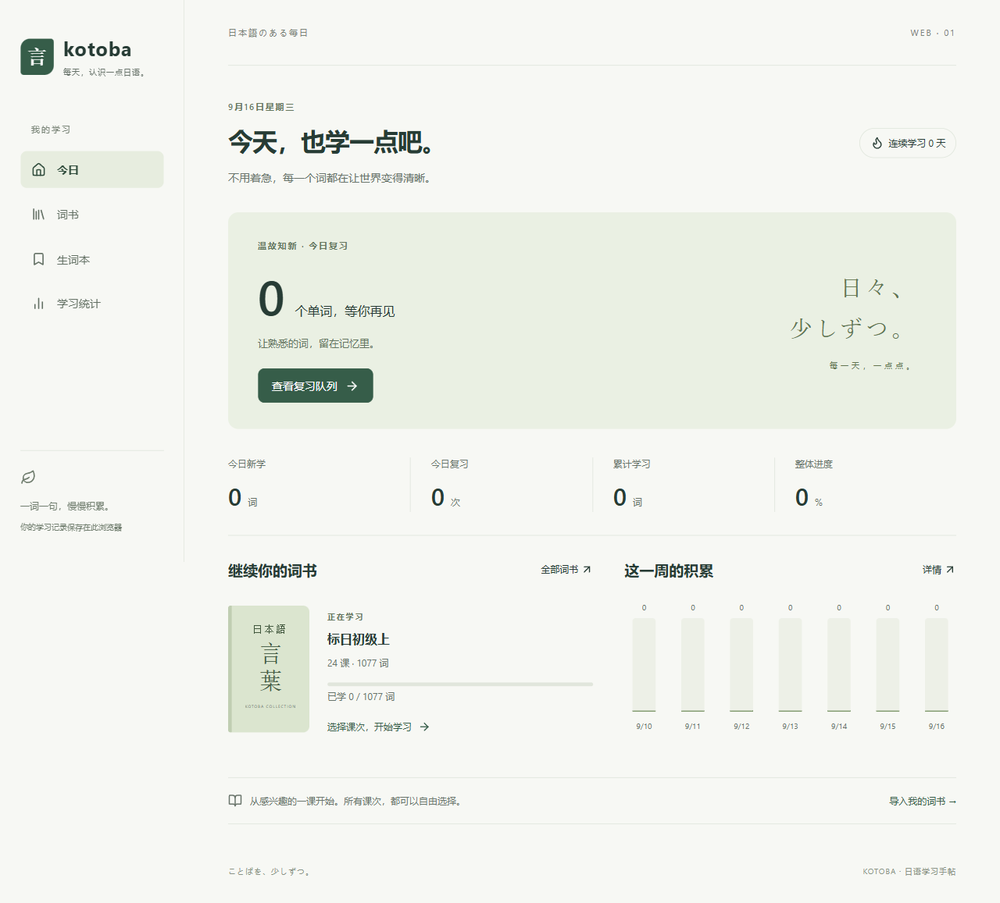
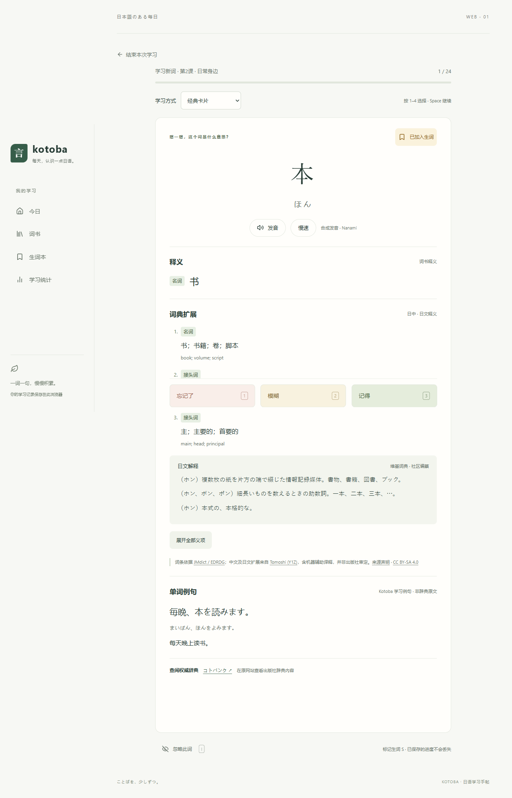
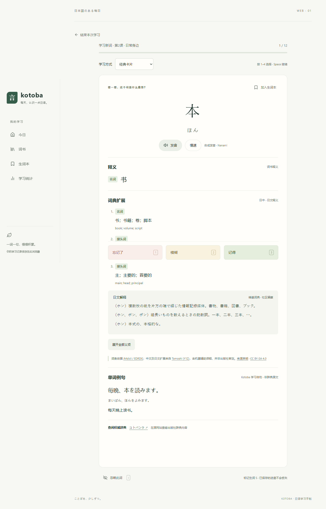

<div align="center">

# Kotobud (旧称 Kotoba)

**现代日语背词与复习工具 | 科学记忆，纯粹背词**  
*A mindful, modern Japanese vocabulary learning and review app powered by FSRS.*

[**🌐 访问官网在线使用 (Official Website)**](https://kotobud.com/) · [**💻 Windows 客户端下载**](https://kotobud.com/download) · [**✨ 功能特性**](https://kotobud.com/features) · [**📖 使用指南**](https://kotobud.com/guide) · [**📝 更新日志**](https://kotobud.com/changelog)

<br/>

[](https://kotobud.com/)
[](LICENSE)
[](https://vuejs.org/)
[](https://www.typescriptlang.org/)
[](https://github.com/open-spaced-repetition/ts-fsrs)
[](https://kotobud.com/download)

</div>

---

## 🌟 为什么选择 Kotobud？

**Kotobud** 专为日语自学者与备考者设计，旨在彻底摆脱传统背词 App 广告弹窗繁琐、复习算法机械死板的困境。

```text
       传统背词软件                                     Kotobud
┌───────────────────────────┐                   ┌───────────────────────────┐
│ 频繁广告与花哨社交激励   │        VS         │ 专注自律、清爽极简学习界面 │
│ 机械式艾宾浩斯固定天数   │                   │ FSRS 动态遗忘间隔科学调度 │
│ 严重依赖云端、断网不可用 │                   │ Local-First 本地优先架构  │
└───────────────────────────┘                   └───────────────────────────┘
```

- 🧠 **科学记忆（FSRS 间隔重复算法）**：放弃陈旧机械的固定记忆天数，全面采用业界公认前沿的 **FSRS 5.2 (Free Spaced Repetition Scheduler)** 算法，根据每次真实反馈（忘记 / 模糊 / 记得）动态推算最优记忆保留率，大幅减轻无谓的复习负担。
- 📚 **标日全六册与 JLPT 词书完备覆盖**：完整匹配《新版中日交流标准日本语》初级、中级、高级全六册课次规划，涵盖 JLPT N5～N1 核心词汇体系，支持自定义 CSV / JSON 双向导入导出。
- 🎯 **多模态交互自检模式**：提供假名选意、汉字选音、听音辨意、多题型混合复习以及经典翻转闪卡模式，全键盘快捷键无缝盲操。
- 📖 **海量日中双语权威词典扩展**：深度集成 JMdict / Tomoshi 217,000+ 条词条，提供权威释义、详细词性分类、日日解释与经典学习例句。
- 🛡️ **本地优先（Local-First）与安全云同步**：数据默认存放在本地 IndexedDB，即使完全离线也能顺畅学习；支持多设备安全增量云同步。
- 💻 **多平台覆盖**：Web 在线版即开即用，Windows 桌面客户端（安装版与免安装绿色版）离线免环境部署，微信小程序正在开发中。

---

## 📸 界面预览 (Screenshots)

<div align="center">
  
  <p><em>学习进度总览 · 7日趋势分析 · 到期复习独立队列</em></p>
  <br/>
  
  <p><em>FSRS 科学记忆评分 · 词性与发音提示 · 生词收藏</em></p>
  <br/>
  
  <p><em>深度集成 21 万词条 JMdict 词典 · 日中/日日双语扩展</em></p>
</div>

---

## 🚀 快速开始 (Quick Start)

### 1. 在线使用 (无需安装)
直接在现代浏览器中访问官方站点即可开启学习：  
👉 [**https://kotobud.com/**](https://kotobud.com/)

### 2. Windows 桌面客户端下载
前往下载页面获取最新版本（支持 Windows 10 / 11 x64）：  
👉 [**https://kotobud.com/download**](https://kotobud.com/download)
- **安装版**：`Kotoba-Setup-0.6.0.exe`（自动创建桌面快捷方式，支持静默更新）
- **绿色便携版**：解压即用，配置与数据随身携带

---

## 🛠️ 本地开发与构建 (Developer Setup)

### 环境要求
- **Node.js**: 22.18+ 或 24+
- **包管理器**: `npm`

### 1. 克隆与安装依赖
```powershell
git clone https://github.com/lil-Detoxify/kotoba.git
cd kotoba
npm install
```

### 2. 启动本地开发服务
```powershell
# 启动 Vite 开发服务器 (默认地址 http://127.0.0.1:5173)
npm run dev

# 或启动常驻后台本地服务 (固定端口 http://127.0.0.1:5174)
npm start
```

### 3. 运行自动化测试与类型检查
```powershell
# 运行 Vitest 核心业务逻辑与事务回归测试
npm test

# TypeScript 严格类型检查与生产环境打包
npm run build

# Playwright 浏览器端到端验收测试 (需先执行 npm run build)
npm run test:e2e
```

### 4. 打包 Windows 桌面客户端
```powershell
npm run build:windows
# 打包产物将输出在 dist/ 与 release/ 目录中
```

---

## ⌨️ 快捷键指南 (Keyboard Shortcuts)

在学习与复习过程中，全面支持全键盘盲操：

| 快捷键 | 功能操作 |
| :--- | :--- |
| <kbd>Space</kbd> / <kbd>Enter</kbd> | 揭示卡片释义 / 提交选择题答案 / 进入下一词 |
| <kbd>1</kbd> | **忘记 (Again)** / 选择选项 1 |
| <kbd>2</kbd> | **模糊 (Hard)** / 选择选项 2 |
| <kbd>3</kbd> | **记得 (Good)** / 选择选项 3 |
| <kbd>4</kbd> | **容易 (Easy)** / 选择选项 4 |
| <kbd>S</kbd> | 标记 / 取消生词本 |
| <kbd>I</kbd> | 忽略此单词（不再参与复习） |

---

## 🏗️ 目录结构与架构边界 (Project Architecture)

项目采用清晰的分层 Monorepo 结构，核心调度与 UI 框架保持高度解耦：

```text
kotoba/
├── apps/
│   ├── web/               # Vue 3 核心单页应用 (Pinia, Vue Router, UI 组件)
│   ├── windows/           # Electron 桌面客户端适配层
│   └── miniprogram/       # 微信小程序端适配层 (基于 Uni-app / Vue 3)
├── packages/
│   ├── core/              # 纯 TypeScript 核心领域模型 (FSRS 调度、学习队列、统计分析，零 UI 依赖)
│   ├── models/            # 跨端共享数据契约与实体定义
│   ├── storage/           # 本地持久化 (IndexedDB adapter, Repository, 事务与快照)
│   ├── importers/         # CSV / JSON 词书解析与校验组装
│   └── shared/            # 跨平台通用时间、字符串工具库
├── docs/                  # 架构设计、FSRS 算法模型、词书版权与 SEO 文档
├── examples/              # 演示用词书数据集 (CSV / JSON)
├── scripts/               # SEO 静态预渲染、Cloudflare 部署与 IndexNow 提交脚本
└── tests/                 # Vitest 自动化单元测试与端到端测试用例
```

---

## 🌐 English Overview

**Kotobud** (formerly known as *Kotoba*) is an open-source, local-first Japanese vocabulary learning and spaced repetition review application.

- **FSRS Algorithm**: Powered by the advanced `ts-fsrs` scheduler, calculating dynamic optimal review intervals based on modern cognitive models.
- **Rich Textbooks**: Full structured support for *New Standard Japanese (新版中日交流标准日本语)* from beginner to advanced, as well as JLPT N5–N1 vocabularies.
- **Multiple Review Modes**: Flashcard, Kana-to-Meaning, Kanji-to-Reading, and Audio Listening tests with full keyboard accessibility.
- **Integrated Dictionary**: Over 217,000 JMdict entries with detailed parts of speech, pitch accents, and bilingual definitions.
- **Cross-Platform**: Accessible via [kotobud.com](https://kotobud.com/), standalone Windows desktop application, and upcoming WeChat Mini Program.

---

## 📄 开源协议与致谢 (License & Acknowledgements)

- **软件代码**：基于 [MIT License](LICENSE) 开源。
- **核心算法**：[ts-fsrs](https://github.com/open-spaced-repetition/ts-fsrs)（Open Spaced Repetition, MIT 许可）。
- **词典数据**：
  - 词条结构依据 [JMdict / EDRDG](https://www.edrdg.org/edrdg/licence.html)；
  - 词典扩展数据来自 [Tomoshi (Y1Z)](https://github.com/tomoshi-app/tomoshi-dict-data)，依据 [CC BY-SA 4.0](https://creativecommons.org/licenses/by-sa/4.0/) 许可共享。
- **开发与构建工具**：[Vue.js](https://vuejs.org/) · [Vite](https://vite.dev/) · [Electron](https://www.electronjs.org/) · [Cloudflare Pages](https://pages.cloudflare.com/)

---

<div align="center">
  <sub>Made with ❤️ for Japanese learners worldwide · <a href="https://kotobud.com/">Kotobud 官方网站</a></sub>
</div>
