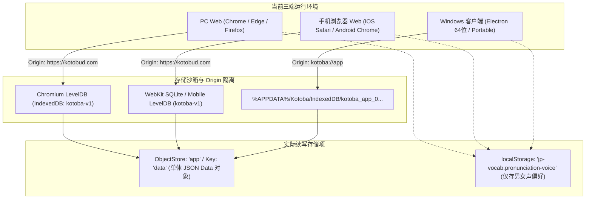
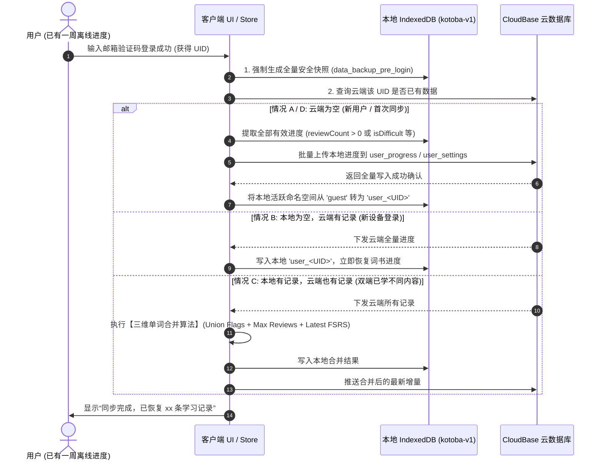

# KotoBud Cloud Sync Architecture Audit (学习记录存储、邮箱登录与云同步技术审计报告)

> **审计执行时间**：2026-09-17  
> **审计范围**：PC Web / 手机浏览器 Web / Windows Electron 客户端  
> **设计目标**：在 100% 保障现有离线可用、不丢试用用户数据、不侵入现有 Cloudflare/R2/TTS 架构的前提下，设计支持“邮箱验证码登录 + 跨端云同步”的技术方案。  
> **执行约束**：只读审计与技术设计，不修改生产代码，不部署，不创建数据库。

> [!IMPORTANT]
> **【架构更正 / Architecture Override (2026-09-17)】**：  
> 本技术审计中关于“使用腾讯 CloudBase Database (NoSQL Document DB) 存储业务数据”的设计已被用户最新指令明确覆盖。  
> **最终实施架构调整为：**
> 1. **腾讯 CloudBase**：**仅负责身份认证（Auth v2 邮箱免密验证码与 Token）**。严禁在 CloudBase 创建任何业务数据库集合（Collections）。
> 2. **Cloudflare D1 (SQL) + Cloudflare Workers**：**负责全部用户数据持久化与云同步**。学习进度（`user_progress`）、复习事件（`review_events`）、用户设置（`user_settings`）和用户映射（`users`）统一存入 Cloudflare D1。
> 3. 详细实施规范请参阅最新落地文档：[`docs/CLOUD_SYNC_IMPLEMENTATION.md`](file:///C:/Users/75481/Documents/ChatGPT/New%20project/jp-vocab/docs/CLOUD_SYNC_IMPLEMENTATION.md)。

---

## 1. Current Storage (当前三端存储全景审计)

经过对项目全部源码及实际运行机制的排查，当前三端存储的底层实现与具体路径如下：



### 1.1 存储介质与实际物理路径详细列表

| 端形态 | 核心存储技术 | 数据库 / Key 名 | 物理路径 / 沙箱位置 | 存储内容 |
| :--- | :--- | :--- | :--- | :--- |
| **PC Web** | IndexedDB | DB: `kotoba-v1`<br>Store: `app`<br>Key: `data` | Chromium 用户目录下的 `IndexedDB/https_kotobud.com_0.indexeddb.leveldb` | 包含 `books`, `lessons`, `words`, `states`, `logs`, `currentBookId`, `seeded`, `textbooksVersion` 等全部业务数据的巨型单体对象。 |
| **PC Web** | localStorage | `jp-vocab.pronunciation-voice` | 浏览器标准 Local Storage | 发音角色偏好（`'female'` / `'male'`）。 |
| **手机 Web** | IndexedDB | DB: `kotoba-v1`<br>Store: `app`<br>Key: `data` | iOS 为 WebKit 沙箱 SQLite 映射；Android 为 Chrome LevelDB | 与 PC Web 结构完全一致，运行于移动端浏览器沙箱内。 |
| **手机 Web** | localStorage | `jp-vocab.pronunciation-voice` | 移动端浏览器 Local Storage | 发音角色偏好（`'female'` / `'male'`）。 |
| **Windows 客户端** | IndexedDB | DB: `kotoba-v1`<br>Store: `app`<br>Key: `data` | `%APPDATA%\Kotoba\IndexedDB\kotoba_app_0.indexeddb.leveldb`<br>（便携版在自定义解压 profile 路径下） | 与 Web 端结构 100% 相同。Windows 仅为加载 `kotoba://app` 的极简沙箱容器。 |
| **Windows 客户端** | localStorage | `jp-vocab.pronunciation-voice` | `%APPDATA%\Kotoba\Local Storage\leveldb` | 发音角色偏好。 |

### 1.2 各项学习状态的实际读写路径排查

通过对 `@jp/core`、`@jp/storage` 和 `apps/web/src/store.ts` 的深层调用审计，各项业务状态的具体读写机制如下：

1. **学习进度 / 掌握状态 (`states: WordState[]`)**：
   - 存储在 `IndexedDB['kotoba-v1']['app']['data'].states`。
   - 每次打分时调用 `evaluate()`，更新 `firstSeenAt`、`lastReviewedAt`、`nextReviewAt`、`reviewCount`、`lapseCount` 及 FSRS `card` 参数。
2. **复习队列 (`queue: Word[]`)**：
   - **不落地持久化**，属纯内存瞬态衍生状态。
   - 进入学习时由 `createStudyQueue(data, mode, lessonIds, now)` 根据当前时间与各个单词的 `nextReviewAt` 实时计算生成。
3. **生词本 (`isDifficult`) 与 忽略词 (`isIgnored`)**：
   - 存储在对应单词的 `WordState` 属性中（`s.isDifficult: boolean`, `s.isIgnored: boolean`）。
   - 通过 `Lists.vue` 和 `app.flag(wordId, key, value)` 读写。
4. **当前词书 (`currentBookId`)**：
   - 存储在 `data.currentBookId`（字符串，如 `'biaori-beginner-upper'`）。
5. **最近学习位置 (Last Studied Position)**：
   - 本地**未独立设表**，在 `Home.vue` 中通过从 `data.logs` 末尾倒序扫描最新一条复习记录关联的 `wordId` -> `lessonId` 动态得出。
6. **每日学习统计 / 连续打卡天数 (`statistics`)**：
   - 由 `statistics(data, now)` 动态聚合 `data.logs`（`ReviewLog[]`）的 `reviewedAt` 日期，计算 7 天直方图与连续 `streak`。
7. **sessionStorage / Cookies / SQLite 审计**：
   - 代码中 `sessionStorage` 出现次数为 **0**。
   - 业务 Cookies 为 **0**。
   - Windows 端没有引入任何 SQLite 原生模块或 `electron-store`，纯粹依托 Chromium 内核内置的 IndexedDB 引擎。

---

## 2. Current Data Model (当前数据模型深度审计)

### 2.1 真实 Vocabulary Progress Record 结构
当前存储在 IndexedDB 中的单条单词学习记录（`WordState`）及答题记录（`ReviewLog`）完整结构如下：

```typescript
// 单条单词的学习进度状态 (WordState)
{
  "userId": "local",                          // 当前硬编码为 'local'
  "wordId": "biaori-beginner-upper-w-1-3",   // 稳定业务词汇 ID
  "status": "learning",                      // 'new' | 'learning' | 'review' | 'mastered'
  "isIgnored": false,                        // 是否加入忽略列表
  "isDifficult": false,                      // 是否加入生词本（星标收藏）
  "firstSeenAt": "2026-09-17T12:00:00.000Z", // 首次学习时间戳
  "lastReviewedAt": "2026-09-17T12:05:00.000Z",// 最近复习时间戳
  "nextReviewAt": "2026-09-18T00:05:00.000Z",// 下次复习到期时间戳
  "reviewCount": 1,                          // 累计复习次数
  "lapseCount": 0,                           // 遗忘次数
  "card": {                                  // ts-fsrs 核心记忆卡片参数
    "due": "2026-09-18T00:05:00.000Z",
    "stability": 2.15,
    "difficulty": 5.2,
    "elapsed_days": 0,
    "scheduled_days": 1,
    "reps": 1,
    "lapses": 0,
    "learning_steps": 1,
    "state": 1                               // State.Learning
  }
}
```

```typescript
// 单次答题复习明细日志 (ReviewLog)
{
  "id": "c82b3d11-5e91-49b8-b112-9c17e33e9d80",
  "userId": "local",
  "wordId": "biaori-beginner-upper-w-1-3",
  "reviewedAt": "2026-09-17T12:05:00.000Z",
  "rating": 3,                                // Grade.Good (1: Again, 2: Hard, 3: Good, 4: Easy)
  "responseTime": 1250,                       // 答题耗时 (ms)
  "studyMode": "new",                         // 'new' | 'review' | 'difficult'
  "previousState": { ... },                   // 变化前状态快照
  "newState": { ... },                        // 变化后状态快照
  "quiz": {                                   // 多题型客观测验详情（可选）
    "type": "kana-meaning",
    "prompt": "アメリカじん",
    "options": ["美国人", "日本人", "中国人", "韩国人"],
    "selected": "美国人",
    "correct": "美国人",
    "isCorrect": true
  }
}
```

### 2.2 Web 与 Windows 数据模型一致性确认
- **模型共享度**：**100% 共享**。
  - Windows 端打包直接抽取 Web 端 Vite 产物（`dist` 目录）。
  - 两端共用相同的 `@jp/models`、`@jp/core`、`@jp/storage` 和 `@jp/importers`。
- **为何目前无法互通？**
  1. **浏览器同源策略（Same-Origin Policy）**：
     - PC / 手机 Web 处于 `https://kotobud.com`。
     - Windows 客户端处于 `kotoba://app`。
     - 协议不同（`https` vs `kotoba`），Chromium 在底层为两者分配了完全相互隔离的 LevelDB 存储文件，任何一方在本地都绝无法直接跨域访问另一方的 IndexedDB。
  2. **缺少中间云端桥梁**：
     - 当前代码为 100% Local-first 架构，虽然预留了 `packages/sync` 接口，但 `status()` 恒定返回 `{status: 'disabled', reason: 'local_only'}`，不存在任何云端数据持久层。

---

## 3. Stable Vocabulary ID (稳定词汇 ID 审计)

### 3.1 审计结论：YES (完全稳定)
经过对教材导入机制与状态查询逻辑的严格审计，**当前项目不存在“使用日语 display word 作为 progress key”的高风险隐患**。

### 3.2 ID 命名与生成规则
1. **内置标日 6 册教材词汇 (9,117 词)**：
   - 规则：`textbookWordId(bookId, lessonOrder, sourceIndex)`
   - 生成格式：`${bookId}-w-${lessonOrder}-${sourceIndex}`
   - 示例：`biaori-beginner-upper-w-1-3`（第 1 册、第 1 课、原始词源第 4 行）。
   - **稳定性**：
     - 该 ID 由词书构建脚本（`scripts/build-textbooks.mjs`）在编译期静态固化，不随词面汉字、平假名或释义文本的修正而变动。
     - 此前将 `～人` 修复还原为 `アメリカ人` 时，`wordId` 依然是 `biaori-beginner-upper-w-1-3`，用户本地的复习进度无缝保持对应。
2. **用户自建/导入词书**：
   - 规则：`crypto.randomUUID()`，导入时为每个单词生成全局唯一 UUID。
3. **关联查找机制**：
   - 代码中查询进度统一使用：`data.states.find(s => s.wordId === word.id)`。
   - 全局绝无以 `word.term` 或 `word.reading` 作为主键查询 `WordState` 的逻辑。

### 3.3 审计发现的潜在缺陷：缺失反向索引与外键冗余
- 当前 `WordState` 内部仅持有 `wordId`，**未直接记录 `bookId` 和 `lessonId`**。
- 在本地单机环境下，客户端通过内存全量词表反查。但在云端分片同步时，若云端要按词书统计复习进度，缺少冗余字段会导致需要 Join 全量词表。
- **推荐策略**：在云同步的数据结构中，强制在 progress 记录上冗余 `bookId` 与 `lessonId` 字段。

---

## 4. Syncable Data vs Local-Only Data (数据分类矩阵)

```
┌────────────────────────────────────────────────────────────────────────┐
│                        KotoBud Data Classification                      │
├────────────────────────────────┬───────────────────────────────────────┤
│    A. 必须跨设备同步 (Syncable)   │      B. 必须本地保留 (Local-only)       │
├────────────────────────────────┼───────────────────────────────────────┤
│ • 单词 FSRS 学习卡片 (card)      │ • 当前学习会话队列 (queue / index)    │
│ • 单词掌握状态 (status)        │ • 页面弹窗 / UI 折叠状态 (expanded)  │
│ • 生词本标记 (isDifficult)     │ • 页面滚动高度 / 临时 Tab 切换        │
│ • 忽略词标记 (isIgnored)       │ • 当前音频播放器实例 / 进度           │
│ • 复习次数与遗忘次数           │ • 教材分册本地缓存 (books/*.json)     │
│ • 首次/上次/下次复习时间戳     │ • 词典分片本地缓存 (dictionary/*.json)│
│ • 当前主学词书 (currentBookId) │ • 设备级语音能力 (hasJapaneseVoice)   │
│ • 最近学习位置 (Book/Lesson)   │ • 离线重试队列 (sync_queue)           │
│ • 用户自导入词书元数据与词表   ├───────────────────────────────────────┤
│ • 每日打卡与答题汇总明细       │      C. 可选同步 (User Preferences)   │
│                                ├───────────────────────────────────────┤
│                                │ • 发音偏好 (女声 A / 男声 C)          │
│                                │ • 题型偏好 (卡片/读音/汉字/听音)      │
└────────────────────────────────┴───────────────────────────────────────┘
```

---

## 5. CloudBase Authentication (腾讯云开发 Auth v2 认证方案评估)

### 5.1 登录流程设计
采用 **“邮箱地址 + 6 位数字验证码”** 免密登录：
1. 用户输入邮箱 -> 点击“获取验证码”；
2. CloudBase Auth 调用邮件服务下发 6 位验证码（有效期 5-10 分钟）；
3. 用户输入验证码 -> 点击“登录 / 注册”；
4. 若邮箱首次使用，CloudBase 自动创建新用户，分配全局唯一 `auth.uid`；若已存在，直接签发登录 Session。

### 5.2 核心机制评估结果

| 审计项 | 评估结论 | 详细说明 |
| :--- | :---: | :--- |
| **Web SDK 可用性** | ✅ 完全可用 | `@cloudbase/js-sdk` 可直接运行在 Vue 3 浏览器环境中。 |
| **Electron 复用性** | ✅ 完全可用 | Windows 客户端运行于 Chromium 内核，协议为 privileged scheme，可无缝运行 Web Auth SDK。 |
| **Session 持久化** | ✅ 自动持久 | SDK 默认将 Token 持久化存储在 `localStorage` 中，窗口关闭或下次启动自动静默恢复。 |
| **Token 刷新** | ✅ SDK 自动维护 | SDK 内置 Refresh Token 机制，在 Access Token（通常 2 小时）过期前后台自动续期。 |
| **跨端一致性** | ✅ 统一无障碍 | 纯邮箱验证码不依赖微信生态，在 iOS Safari、Android Chrome、PC 浏览器和 Windows EXE 上表现完全一致。 |
| **发信通道依赖** | ⚠️ **需配置发信源** | CloudBase 自带的免费测试邮件仅供调试（配额极少且易被拦截），正式使用必须绑定腾讯云 SES（代码/域名认证）或标准 SMTP 发信服务器。 |
| **免费额度** | ✅ 适合早期试用 | 基础版资源包或按量计费对于 <100 人的早期试用阶段，每月费用基本在保底套餐内（~9.9-19.9 元/月）。 |
| **供应商锁定风险** | ⚠️ **中度风险** | 若前端直接重度绑定 CloudBase 专有 SDK 方法，未来迁移成本高。**必须在 `@jp/sync` 的接口适配层进行包装，业务层只面向 `SyncClient` 抽象编程**。 |

---

## 6. Proposed Cloud Schema (最小可行云端数据模型)

基于 MongoDB / CloudBase 文档数据库设计的最小可行集合规范：

### 6.1 `user_progress` (单词进度集合 - 核心表)
- **设计原则**：单词单文档（One Document Per Word），原子级更新，彻底杜绝单用户大 JSON 覆写覆盖！
- **集合结构**：
  ```json
  {
    "_id": "<userId>_<wordId>",            // 复合唯一主键：天然防止并发重复插入
    "userId": "u_8f3a9c2d1e",              // 对应 auth.uid
    "wordId": "biaori-beginner-upper-w-1-3",
    "bookId": "biaori-beginner-upper",     // 冗余存储，便于按书聚合
    "lessonId": "biaori-beginner-upper-l-1",
    "status": "learning",                  // 'new' | 'learning' | 'review' | 'mastered'
    "reviewCount": 3,
    "lapseCount": 0,
    "isDifficult": false,
    "isIgnored": false,
    "firstSeenAt": "2026-09-17T12:00:00.000Z",
    "lastReviewedAt": "2026-09-17T12:05:00.000Z",
    "nextReviewAt": "2026-09-19T08:00:00.000Z",
    "card": {                              // FSRS 记忆卡片核心状态
      "due": "2026-09-19T08:00:00.000Z",
      "stability": 3.42,
      "difficulty": 4.8,
      "elapsed_days": 1,
      "scheduled_days": 2,
      "reps": 3,
      "lapses": 0,
      "learning_steps": 0,
      "state": 2
    },
    "updatedAt": "2026-09-17T12:05:00.000Z", // 毫秒级 ISO 时间戳（冲突判定核心）
    "version": 3                           // 乐观锁自增版本号
  }
  ```
- **数据库索引配置**：
  - `_id`: 唯一索引（默认）
  - `userId_1_updatedAt_1`: 复合索引（支持客户端根据 `lastSyncCursor` 极速拉取增量变更）
  - `userId_1_bookId_1`: 复合索引（支持按词书统计复习量）

### 6.2 `user_settings` (用户配置与当前状态表)
- 每个用户仅一条记录：
  ```json
  {
    "_id": "<userId>",
    "userId": "u_8f3a9c2d1e",
    "email": "user@example.com",
    "currentBookId": "biaori-beginner-upper",
    "lastStudiedPosition": {
      "bookId": "biaori-beginner-upper",
      "lessonId": "biaori-beginner-upper-l-1",
      "wordId": "biaori-beginner-upper-w-1-3",
      "updatedAt": "2026-09-17T12:05:00.000Z"
    },
    "preferences": {
      "pronunciationVoice": "female"
    },
    "streak": 5,
    "lastActiveDate": "2026-09-17",
    "updatedAt": "2026-09-17T12:05:00.000Z"
  }
  ```

### 6.3 `custom_books` (用户自建词书 - 按需使用)
- 仅当用户在导入页创建了非标日官方词书时写入：
  ```json
  {
    "_id": "<userId>_<bookId>",
    "userId": "u_8f3a9c2d1e",
    "bookId": "custom_uuid_...",
    "book": { ... },
    "lessons": [ ... ],
    "words": [ ... ],
    "updatedAt": "2026-09-17T12:00:00.000Z"
  }
  ```

---

## 7. Migration (现有试用用户本地记录无损迁移方案)

针对当前已经积累了学习进度的真实试用用户，设计了“**五步无损迁移流**”，坚决杜绝登录导致的数据清空。



### 严格执行的“五项铁律”：
1. **快照先行**：在向云端发送数据或合并前，本地必须同步保留一份快照，若流程异常中断可 100% 回滚。
2. **云端成功确认后才切换标识**：若云端网络超时或报错，本地保持原样，不删除、不重置。
3. **禁止空覆盖**：当云端记录数为 0 时，绝对禁止下发空数组覆盖本地数据。
4. **有效数据过滤**：只同步真正学习过（`firstSeenAt` 存在）或标记过（`isDifficult` / `isIgnored`）的词条，未学词条（9,000+）不占用云端配额与上传流量。
5. **异常降级**：若发生网络崩溃，提示“登录成功，数据将在联网稳定后自动完成合并”，当前界面继续使用本地数据背词。

---

## 8. Conflict Resolution (多设备冲突解决算法)

### 场景分析
- 12:00 在 Windows 上学习了单词 A（`reviewCount = 1`, 打分 Good, stability = 2.1）
- 14:00 手机在离线状态下也复习了单词 A（`reviewCount = 2`, 打分 Easy, stability = 4.5）
- 15:00 手机联网触发同步，此时产生冲突。

### 为什么单纯的 Last-Write-Wins (LWW) 不够安全？
若单纯以时间戳决定胜负，若用户某台设备时钟不准或离线修改了无关标记，可能将另一台设备上好不容易建立的高稳定度 FSRS 卡片覆盖为更低或重置的状态。

### 推荐轻量算法：【三维单词合并算法 (Three-Way Word State Merge)】
针对同一单词的多端冲突，在合并函数中执行原子规则：

```typescript
function mergeWordState(local: WordState, remote: WordState): WordState {
  // 1. 标志位并集策略 (Union Flags)：任意一端收藏生词或忽略，合并后均保持生效
  const isDifficult = local.isDifficult || remote.isDifficult;
  const isIgnored = local.isIgnored || remote.isIgnored;

  // 2. 复习次数保底递增 (Max Review Count)
  const reviewCount = Math.max(local.reviewCount ?? 0, remote.reviewCount ?? 0);
  const lapseCount = Math.max(local.lapseCount ?? 0, remote.lapseCount ?? 0);

  // 3. FSRS 记忆卡片按“实际最新复习时间”判定归属
  const localReviewTime = local.lastReviewedAt ? new Date(local.lastReviewedAt).getTime() : 0;
  const remoteReviewTime = remote.lastReviewedAt ? new Date(remote.lastReviewedAt).getTime() : 0;
  
  // 选取最近实际参与过复习决策的一方
  const master = localReviewTime >= remoteReviewTime ? local : remote;

  return {
    ...master,
    isDifficult,
    isIgnored,
    reviewCount,
    lapseCount,
    firstSeenAt: local.firstSeenAt && remote.firstSeenAt
      ? (new Date(local.firstSeenAt) < new Date(remote.firstSeenAt) ? local.firstSeenAt : remote.firstSeenAt)
      : (local.firstSeenAt || remote.firstSeenAt)
  };
}
```
- **算法优势**：代码量极小（< 30 行），零复杂依赖，完全数学确定性；能绝对保护 FSRS 算法健康度与用户记忆稳定性。

---

## 9. Offline-First (离线优先同步机制)

```
[用户在 UI 点击“记住了 / 忘记了”]
               │
               ▼ (0ms 纯本地执行)
[1. 立即更新 Pinia Store 内存响应式状态]
               │
               ▼ (立即持久化)
[2. 写入本地 IndexedDB ('data_user_<UID>')] ──> 用户无感知，翻卡流畅零延迟
               │
               ▼ (记录待同步增量)
[3. 追加至本地队列 IndexedDB ('sync_queue')]
               │
               ▼ (后台异步任务，防抖 3-5 秒)
[4. Sync Worker 检查网络连接]
       ├── [离线] ──> 队列静默驻留，等待 window 'online' 事件唤醒
       └── [在线] ──> 批量打包 SyncRequest 发送至 CloudBase
                           │
                           ▼ (成功响应)
                     [5. 清除对应队列项，更新本地 lastSyncTime]
```

### 架构适配性结论
当前代码中每次评分操作由 `store.ts` 的 `rate()` 统一收口。我们只需在 `rate()` 和 `flag()` 执行完成时，向本地的 `sync_queue` 表中推入一条 `{ wordId, timestamp }`，前端组件完全不受影响，天然具备完美的离线优先适配能力。

---

## 10. Account Isolation (多账号与游客数据隔离)

### 10.1 串号与数据污染风险
若多个用户在同一台电脑（或借用手机）上登录，必须确保：
- 用户 A 登出后，用户 B 登录绝不能看到用户 A 的生词本与复习进度。
- 退出登录时，未登录的游客模式必须拥有独立纯净的空间。

### 10.2 命名空间隔离设计
在同一个 IndexedDB `kotoba-v1` 内部，将存储键解耦为动态前缀：
- **游客模式（未登录）**：读取与写入键为 `'data_guest'`。
- **登录账号**：读取与写入键为 `'data_user_' + auth.uid`。
- **当前活跃指示器**：在 `localStorage` 记录 `'current_active_identity'`（`'guest'` 或 `'u_xxxx'`）。

### 10.3 状态流转策略
1. **游客使用中**：所有进度存放在 `'data_guest'`。
2. **首次登录转正**：
   - 检验如果云端数据为空，将 `'data_guest'` 数据直接复制给 `'data_user_' + UID`，然后清空或重置 `'data_guest'`。
   - 如果云端已有数据，提示用户：“是否将本机的离线学习记录合并到该账号？”，用户确认后合并，拒绝则仅加载云端账号数据，保留本地游客数据。
3. **退出登录 (Logout)**：
   - 清空内存状态 -> 清除 Auth Session -> 活跃指示器切回 `'guest'` -> 加载 `'data_guest'`。
   - **保留已登录账号的本地缓存**（方便该用户下次在当前设备输入验证码登录后秒级复原），但绝不向未经验证的游客暴露。

---

## 11. Security (数据库安全规则与凭据防泄露)

### 11.1 CloudBase 数据库安全规则 (Security Rules)
严禁将数据过滤逻辑寄托于前端代码传递的参数。必须在云数据库控制台配置行级权限规则：

```json
{
  "read": "auth.uid != null && auth.uid == doc.userId",
  "write": "auth.uid != null && auth.uid == doc.userId"
}
```
- **安全效果**：
  - 未登录用户（`auth.uid == null`）完全禁止读写 `user_progress` 集合。
  - 已登录用户尝试通过 API 修改或读取别人的记录时，数据库引擎在底层直接阻断（Permission Denied）。

### 11.2 邮件防刷与接口限流
1. **前端限制**：获取验证码按钮触发后，强制进入 60 秒冷却倒计时。
2. **后端频控（CloudBase 安全规则 / 云函数限流）**：
   - 单邮箱限制：同一邮箱 60 秒内只能请求 1 次验证码，24 小时内最多请求 8 次。
   - 单 IP 限制：同一 IP 地址每小时最多请求 15 次，防脚本刷信。
   - 验证码有效期 5 分钟，且单个验证码输错 5 次后自动作废。

### 11.3 客户端凭据安全
- Web 端仅保留短期 Access Token，不接触任何云管理密钥（SecretId / SecretKey 严禁打包入前端代码）。
- Windows Electron 启用 `contextIsolation: true` 和 `sandbox: true`，页面渲染进程无法调用底层 Node.js 系统 API，避免恶意脚本外泄本地 Token。

---

## 12. Cost (初期成本预估)

| 用户规模 | 邮箱验证码发送量与预估费用 | CloudBase 数据库与读写量 | 静态托管与流量 | 每月总成本预估 |
| :---: | :--- | :--- | :--- | :---: |
| **10 人 (测试期)** | 每日约 1-3 封，免费额度完全覆盖 | 存储 < 5 MB，读写 < 1 万次/月，免费/保底内 | 现有 Cloudflare Pages 免费 | **约 9.9 ~ 19.9 元/月**<br>*(仅云开发保底基础套餐)* |
| **100 人 (初期公测)** | 每日约 10-20 封，SMTP 约 1-3 元/月 | 存储 < 50 MB，读写约 20 万次/月 | 现有 Cloudflare 免费层 | **约 15 ~ 30 元/月** |
| **1,000 人 (成长期)** | 每日约 100-300 封，邮件推送约 15-30 元/月 | 存储 < 500 MB，读写约 200 万次/月 | 现有 Cloudflare 免费层 | **约 40 ~ 90 元/月** |

> **关键成本点提示**：
> 最先产生费用的并非数据流量或计算，而是**腾讯云开发本身的基础资源包保底月租（约 9.9 - 19.9 元/月）**，以及配置独立发信域名时的 SMTP / 邮件推送服务费用。

---

## 13. Risks (潜在风险与防范预案)

1. **邮件进垃圾箱风险 (High)**：
   - *风险*：国内主流邮箱（QQ 邮箱、163 邮箱）对无独立域名 SPF / DKIM 认证的发信服务极易拦截或直接判定为垃圾邮件。
   - *防范*：初期必须在腾讯云 SES 或自有域名邮箱（如 `service@kotobud.com`）中配置正确的 TXT（SPF 记录）和 CNAME（DKIM 记录），并在界面提示“若未收到，请检查垃圾箱”。
2. **巨量单词初始化写入性能风险 (Medium)**：
   - *风险*：若初次同步把 9,117 个单词全部往云端推，会导致首屏请求阻塞数秒并耗尽配额。
   - *防范*：**仅同步活跃词条**（即 `firstSeenAt` 存在、`reviewCount > 0`、`isDifficult` 或 `isIgnored` 的词条）。普通用户通常学习了几百个词，数据量仅为数十 KB，毫秒级上传。
3. **教材词条 ID 误修改导致失联风险 (High)**：
   - *风险*：若后续修改词书时修改了 `textbookWordId` 的命名公式，会导致云端和本地旧记录无法对应。
   - *防范*：在项目 CI 和回归测试中将 `textbookWordId` 列入永久锁定规范，禁止重命名已发布词书的 ID 格式。
4. **单体 `Data` 对象向单词文档解耦的迁移过渡期风险 (Medium)**：
   - *风险*：本地 IndexedDB 目前是将全部数据存为一个巨大的 `data` 对象，而云端是单词一条文档。
   - *防范*：在 `@jp/storage` 保持本地接口兼容，同步模块负责将本地单体对象中的 `states` 数组与云端单条记录进行双向拆解与组装（Serialize / Deserialize）。

---

## 14. Implementation Plan (后续实施阶段规划)

若方案经确认通过，建议按如下阶段有条不紊推进，每一步均有明确可验收成果：

```
Phase 1: 基础设施与邮件通道就绪 (云环境开通 + 域名发信解析)
   ↓
Phase 2: 本地存储层解耦与快照保障 (多账号 Key 隔离 + 迁移回滚机制)
   ↓
Phase 3: 同步核心算法实现 (@jp/sync 接入三维合并与离线队列)
   ↓
Phase 4: Web 端邮箱登录 UI 与状态联动 (登录弹窗 + 自动转正)
   ↓
Phase 5: Staging 真实多端联调验收 (PC / 手机断网并发验证)
   ↓
Phase 6: Windows Electron 客户端适配与发布
   ↓
Phase 7: 正式发布与灰度观测
```

- **Phase 1: 基础设施配置**：创建 CloudBase 环境、开通数据库安全规则、配置发信域名解析（SPF/DKIM）。
- **Phase 2: 本地存储解耦**：升级 `IndexedDbRepository` 支持命名空间（`data_guest` 与 `data_user_<UID>`），编写单元测试验证本地快照与回滚。
- **Phase 3: 同步算法库建设**：在 `packages/sync` 中实现 `CloudBaseSyncClient` 与 `mergeWordState` 三维冲突合并算法。
- **Phase 4: 前端登录 UI 与鉴权**：设计统一轻量化邮箱验证码登录弹窗，保持现有免登录游客模式 100% 可用。
- **Phase 5: Web 端端到端验证**：在 Staging 环境中验证手机 Safari 与 PC Chrome 之间的学习进度秒级互通。
- **Phase 6: Windows 端验证**：在 Electron 中验证自定义协议下的登录持久化与离线状态同步。
- **Phase 7: 灰度上线**：正式推向 `https://kotobud.com`。

---

## 15. Files Likely To Change (下一阶段预计修改文件)

| 文件路径 | 预期改动性质 | 改动内容简述 |
| :--- | :---: | :--- |
| `packages/models/src/index.ts` | 增补类型 | 扩充 `User`, `SyncStatus`, `WordState.updatedAt`。 |
| `packages/storage/src/index.ts` | 改造存储层 | 支持多用户命名空间 key（`data_guest`, `data_<UID>`）及本地备份快照。 |
| `packages/sync/src/index.ts` | 实现同步端点 | 实现离线队列管理、3-way 单词合并算法及 CloudBase 接口通信。 |
| `apps/web/src/store.ts` | 联动 Store | 引入用户身份状态（`currentUser`），在 `rate()` / `flag()` 中接入异步同步队列。 |
| `apps/web/src/components/LoginModal.vue` | [NEW] 新增组件 | 邮箱验证码登录弹窗（含 60s 倒计时与错误重试交互）。 |
| `apps/web/src/components/UserNav.vue` | [NEW] 新增组件 | 顶部导航栏增加用户头像 / 登录提示 / 同步状态图标。 |
| `tests/sync.test.ts` | 补充测试 | 补充合并冲突、网络中断与离线队列的自动化回归测试。 |

---

## 16. Questions Requiring User Decision (需要您决策的事项)

进行下一阶段开发前，仅需明确以下 3 个核心决策：

1. **发信通道选择**：
   - 选项 A (推荐)：使用腾讯云 SES 邮件推送服务（需配合您持有的 `kotobud.com` 域名添加 2 条 DNS 解析记录：SPF 与 DKIM，送达率最高）。
   - 选项 B：使用您自有的企业邮箱或个人邮箱 SMTP 凭据（如 QQ 企业邮箱 / 网易企业邮）进行发信。
2. **多端同时在线时的自动同步时机**：
   - 选项 A (推荐)：**背词完成即触发防抖同步 (Debounced Background Sync)**：每答完一组词或每隔 3-5 秒后台自动静默推送，离开页面或切换 App 时自动触发。
   - 选项 B：**手动同步为主 + 启动时拉取**：仅在进入应用时拉取一次，退出或用户点击“同步”时上传。
3. **游客登录时的合并确认策略**：
   - 选项 A (推荐)：**静默安全合并**（若本地有学习记录且云端也有，自动按三维安全算法合并，不打扰用户）。
   - 选项 B：**弹窗提示询问**（弹窗告知“检测到本机有离线记录，是否合并至当前账号？”）。
