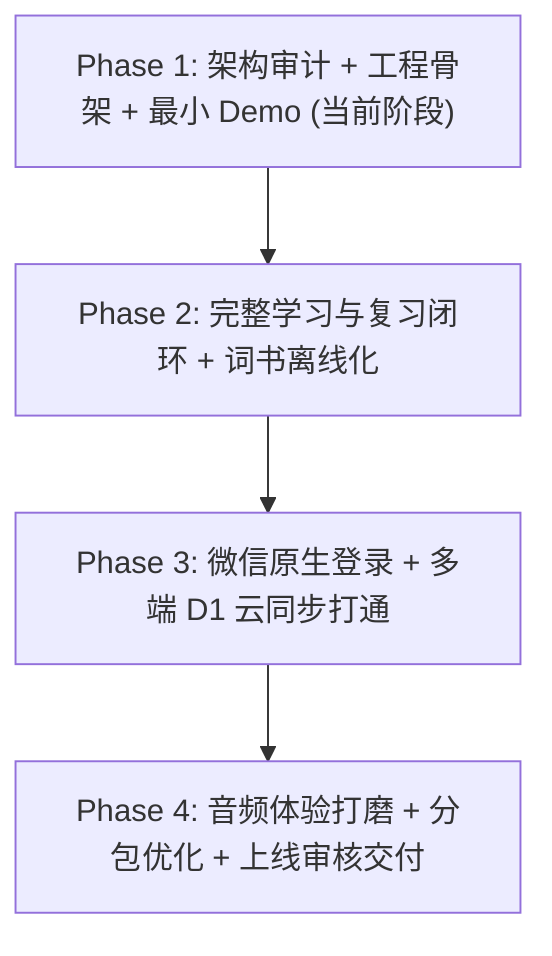

# KotoBud 微信小程序迁移与跨端架构审计报告

> 本文档基于 KotoBud (Kotoba) Web & Windows 0.6.0 正式基线（Commit: `eeeab608`）编写，旨在系统性评估当前业务逻辑、核心算法、持久化层、网络与音频系统迁移至**微信小程序**的技术可行性、代码复用边界与实施路线。

---

## 1. 当前项目架构全景

KotoBud 目前采用基于 npm workspaces 的轻量 Monorepo 组织架构：

```text
jp-vocab/
├── apps/
│   ├── web/               # Vue 3 + Pinia + Vite + Lucide SPA (Web 端)
│   └── windows/           # Electron 桌面包装层 (离线加载 + kotoba:// 协议 + R2 音频)
├── packages/
│   ├── models/            # 领域实体类型定义 (Book, Word, WordState, ReviewLog 等)
│   ├── core/              # 核心业务算法 (ts-fsrs 调度、队列生成、统计、状态重放与 LWW 合并)
│   ├── storage/           # IndexedDB 事务化本地持久层 (IndexedDbRepository, 级联删除等)
│   ├── sync/              # 远端同步与认证 (CloudBaseAuthClient, WorkerSyncClient, 队列与重试)
│   ├── dictionary/        # JMdict 分片词典分桶哈希与义项匹配算法
│   ├── importers/         # CSV/JSON 格式解析与标日教材导入器
│   └── shared/            # 纯工具函数 (dayKey, daysBefore)
├── scripts/
│   └── cloudflare-worker.js # 部署于 Cloudflare 的边缘 API (认证、D1 SQL 同步、静态分发)
└── docs/                  # 架构设计与交接规范
```

- **数据流与架构原则**：
  - **离线优先 (Offline-First)**：本地默认以游客态（`data_guest`）存储全部学习数据，核心学习/复习闭环不依赖外网连接。
  - **业务数据不出 Cloudflare**：CloudBase 仅用于发放邮箱 OTP 验证码；所有学习记录、复习历史、用户偏好均存储于 Cloudflare D1（SQL）。
  - **音频分级加载**：18,072 个 Google WaveNet TTS 音频存储于 Cloudflare R2 私有存储桶，通过 Worker 路由对外提供按需流式拉取。

---

## 2. 跨端代码复用分级归档

在微信小程序受限沙箱（无 DOM、无 BOM、无 `window`/`document`、无 `localStorage`、无 `fetch`、无 `HTMLAudioElement`、包体积受限 2MB）的背景下，现有代码归档如下：

### A. 可直接复用 (Directly Reusable) —— 预期复用率 100%

此类模块均为纯 TypeScript/JavaScript 编写，无任何浏览器宿主环境依赖，已验证可直接在小程序 JS 引擎中运行：

1. **`@jp/models` (领域模型层)**：
   - 包含 `Book`, `Lesson`, `Word`, `WordSense`, `WordState`, `ReviewLog`, `ReviewEvent`, `UserSettings`, `CloudProgressDoc`, `SyncQueueItem`, `Data` 等全部接口。
   - 完全跨端通用，类型约束零修改复用。
2. **`@jp/core` (核心调度与算法层)**：
   - **FSRS 间隔重复算法**：依赖的底层库 `ts-fsrs` 仅进行纯数学与时间推演，完全兼容小程序。
   - **学习队列与题型调度**：`createStudyQueue`, `getDueWords`, `getDifficultWords`, `evaluate`。
   - **数据合并算法**：`reconcileFsrsFromEvents`（基于事件的确定性卡片重放）与 `mergeWordStateWithLww`（字段级 Last-Write-Wins 冲突合并）。
   - **统计计算**：`statistics()`, `progress()` 计算连续天数、7日柱状图数据、各掌握度单词计数。
   - **选择题题型生成**：`packages/core/src/quiz.ts` 纯计算生成混淆项与选项乱序。
3. **`@jp/shared` (通用日期工具)**：
   - `dayKey()`, `daysBefore()` 纯 Date 计算工具。
4. **内置词书元数据与分课索引**：
   - `textbooks-metadata.json`（6 册标日元数据与课次大纲），体量仅 21 KB，可直接打包内置于小程序。
   - `apps/web/src/seed.json`（48 词演示词书），可直接作为初始词书。
5. **词典分桶哈希算法**：
   - `packages/dictionary/src/index.ts` 中的 `dictionaryBucket()` 与 `matchEntries()` 纯字符算法。

---

### B. 通过 Adapter / Runtime Abstraction 后复用 —— 预期复用率 70% ~ 80%

此类模块业务逻辑成熟，但底层实现绑定了 Web/浏览器专有 API，需抽象为标准接口并在小程序端提供适配器：

| 模块 | Web / 当前实现 | 微信小程序环境差异 | 适配方案 (Adapter Abstraction) |
| :--- | :--- | :--- | :--- |
| **持久化存储**<br>(`@jp/storage`) | 基于 `idb` (`IndexedDB`)，单库多事务 | 小程序无 IndexedDB，仅支持 `wx.setStorage`（单 key 限制 1MB，总限额 10MB）或文件系统 `wx.getFileSystemManager` | 统一抽象 `Repository` 接口：<br>Web 保留 `IndexedDbRepository`；<br>小程序实现 `WxStorageRepository`（大对象写入本地文件 `wx.env.USER_DATA_PATH/kotoba_data.json`，小配置使用 `uni.setStorageSync`）。 |
| **音频发音**<br>(`usePronunciation`) | `new Audio(url)` + `speechSynthesis` | 无 `HTMLAudioElement`，无 Web Speech API | 抽象 `AudioAdapter`：<br>优先通过 `uni.createInnerAudioContext()` 播发 Cloudflare R2 远程 Google WaveNet MP3；<br>离线无预录音时降级提示或引导微信同声传译插件。 |
| **网络请求**<br>(`WorkerSyncClient`, `dictionary`) | 全局 `fetch()` + `AbortController` + `credentials: 'include'` | 小程序无原生 `fetch`，Cookie 不自动透传，需使用 `uni.request` / `wx.request` | 抽象 `HttpClient` / `NetworkAdapter`：<br>统一封装超时控制与重试逻辑，请求头显式挂载 `Authorization: Bearer <token>`；<br>配置白名单合法域名 `https://kotobud.com`。 |
| **凭证持久化**<br>(`CloudBaseAuthClient`) | `localStorage` + `sessionStorage` | 小程序无 Web Storage，无 `window` | 抽象 `StorageAdapter`：<br>统一调用 `uni.getStorageSync` / `uni.setStorageSync` 存储 `refresh_token` 与用户基础信息。 |

---

### C. 微信小程序必须重新实现 (Must Rewrite) —— 预期需新写 100%

此类模块与宿主渲染、窗口系统或平台特性紧密耦合，无法直接移植：

1. **路由与页面结构 (Vue Router -> `pages.json`)**：
   - Web 端采用 `vue-router` 历史模式/哈希模式，动态组件切换。
   - 小程序必须遵循微信页面生命周期与 `pages.json` 静态注册规范，采用 `uni.navigateTo`, `uni.switchTab`, `uni.redirectTo` 驱动跳转。
2. **视图层组件与 DOM 标签 (HTML -> 小程序原生标签)**：
   - Web 原生标签 `<div>`, `<section>`, `<span>`, `<a>`, `<button>`，必须全面迁移至 `<view>`, `<text>`, `<button>`, `<scroll-view>`。
   - 替换 Lucide 图标库（SVG DOM 方案）为针对小程序编译优化的轻量图标组件或静态资源。
   - 清理现代 Web CSS 伪类选择器（如 `:has()`, `:user-valid`），采用跨端安全的 Flexbox 与 scoped CSS。
3. **微信生态认证与登录**：
   - 新增 `wx.login` 一键登录流，通过后端 Worker 或云函数完成 `code2Session` 换取 OpenID。
   - 保留与既有 Web 账号体系（邮箱 + 密码）绑定打通的能力，实现全平台学习数据实时同步。
4. **全量词典静态资源按需下发**：
   - Web/桌面端可直接分发 212MB 词典文件；小程序受限于主包 2MB、整包 20MB 的强制约束，绝不能将 212MB JSON 打包进项目。
   - 改为通过 `https://kotobud.com/dictionary/${bucket}.json` 远程按需拉取，并在小程序本地文件系统维护 50MB 上限的 LRU 缓存。

---

## 3. 技术方案选型：为什么优先推荐 uni-app + Vue 3 + TypeScript

对当前 Kotoba 项目而言，跨端框架的核心诉求是：
1. **最大化复用已有的 Vue 3 响应式代码与组件逻辑**；
2. **零阻碍调用 `@jp/core`、`@jp/models` 等纯 TypeScript 业务模块**；
3. **支持标准 Vite 编译链，并能无缝嵌入当前 npm workspaces**；
4. **后续具备低成本扩展至 iOS / Android App 的潜在能力**。

| 维度 | uni-app (Vue 3 + Vite) (推荐) | 微信原生小程序 (原生 TS) | Taro (React/Vue) |
| :--- | :--- | :--- | :--- |
| **技术栈契合度** | **极高**（与 Web 0.6.0 完全一致的 Vue 3 Composition API） | 较低（WXML / WXSS / Page 配置，语法断层） | 中等（编译时对 Vue 3 支持略复杂，配置重） |
| **Core 库复用** | **零成本**（直接以 TS 引用 packages） | 需单独打包或编译为微信格式脚本 | 可复用，但 Monorepo 配置相对繁琐 |
| **生态成熟度** | 国内小程序与多端开发事实标准，中文生态完善 | 官方原生，但无法一套代码复用至 Web/App | 京东团队维护，偏 React 生态 |
| **工程开销** | 采用官方 `uni-preset-vue#vite-ts`，直接接入 Monorepo | 需要维护完全独立的语法结构 | 需要引入额外工具链 |

**结论**：强烈推荐 **uni-app + Vue 3 + TypeScript**。它让 `apps/miniprogram` 能够以与 `apps/web` 几乎完全相同的语法风格编写，极大降低认知负荷与维护成本。

---

## 4. 预计整体代码复用比例评估

- **业务逻辑与算法 (`@jp/core`, `@jp/models`, `@jp/shared`)**：**100% 复用**（约占整个核心业务代码的 35%）。
- **数据状态与导入逻辑 (`useApp` 状态机模式、教材索引)**：**约 75% 复用**（存储与请求替换为 Adapter，状态流转保持不变）。
- **网络与同步协议 (`@jp/sync` 契约、D1 数据结构)**：**约 80% 复用**（协议完全对齐，仅替换底层传输驱动）。
- **视图层与 UI 组件 (`apps/web/src/pages/*`)**：**约 30% 结构复用，需 100% 模板重写**（从 HTML 转换为小程序 `<view>`，样式规范保持一致）。
- **总体预估工程代码复用率**：**65% ~ 72%**。

---

## 5. 主要技术风险与应对策略

1. **小程序包体积限制 (2MB 主包)**：
   - **风险**：若直接将 6 册标日教材（1.2MB）或词典分片误打入主包，极易触碰 2MB 上限导致无法上传审核。
   - **策略**：主包仅内置 `seed.json`（48 词）与轻量骨架；6 册教材作为独立子包（Subpackages）配置，或通过 `https://kotobud.com/data/books/` 远程 CDN 动态下发并落盘。
2. **Storage 存储容量上限 (10MB)**：
   - **风险**：微信 `wx.setStorage` 单 key 不超 1MB，总空间上限 10MB。若长期学习产生数千条 `review_events` 与详细状态，可能导致写入异常。
   - **策略**：日常高频读写使用 `wx.getFileSystemManager` 操作沙箱私有目录中的 JSON 文件（上限达 200MB），仅小型 session 与 token 存入 Storage。
3. **合法域名配置与网络限制**：
   - **风险**：微信小程序要求所有 `request`, `downloadFile` 必须为备案完成的 HTTPS 域名。
   - **策略**：项目正式域名 `https://kotobud.com` 已配置全站 HTTPS 与 Cloudflare 边缘证书，需在微信小程序后台 `开发设置 -> 服务器域名` 登记加入。
4. **音频播放静音与锁屏交互**：
   - **风险**：部分 iOS 设备在静音开关开启时，`innerAudioContext` 默认无声。
   - **策略**：初始化时调用 `wx.setInnerAudioOption({ obeyMuteSwitch: false })`，确保背词发音不受物理静音开关限制。

---

## 6. 后续 Phase 2 ~ Phase 4 实施拆分建议



- **Phase 2: 核心学习闭环与词书管理 (重点：脱机体验)**
  - 接入完整 6 册标日教材分包或 CDN 动态加载。
  - 实现完整的学习流程：卡片揭示、假名选意、汉字选假名、听音练习。
  - 实现 FSRS 遗忘与复习队列完整闭环，对接 `WxStorageRepository`。
- **Phase 3: 用户系统与云同步 (重点：跨端一体化)**
  - 实现 `wx.login` 无感静默登录，发放 KotoBud 统一 session。
  - 提供“绑定 Web / Windows 邮箱账号”功能，实现现有云端数据平滑迁移与合并。
  - 接通 `WorkerSyncClient`，实现小程序端与 Web/Windows 端的双向实时 LWW 同步与事件重放。
- **Phase 4: 性能体验与上线发布 (重点：合规与审核)**
  - 深度优化首屏加载与分包体积。
  - 音频并发播放控制与网络缓存优化。
  - 隐私政策协议弹窗、合规审核准备与正式提交微信审核。
